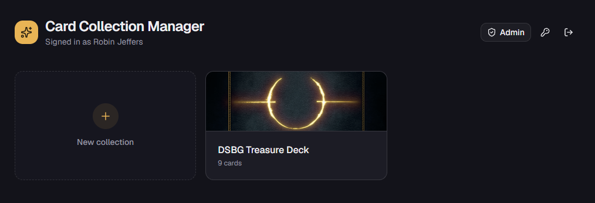
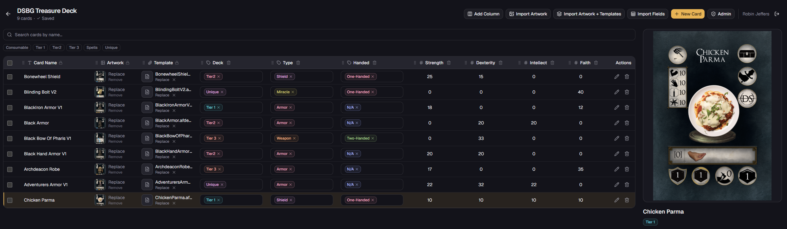

# Card Collection Manager

A self-hosted web app for cataloging and designing card collections. It pairs a
spreadsheet-style data grid with live artwork previews, so you can manage the *data* behind
each card (name, stats, tags) and the *assets* for each card (artwork image, print-ready
template file) in one place.

It is built to run on your own hardware with Docker — your cards, images, and accounts never
leave your machine.

> ### Built entirely by AI
>
> Every part of this application — the code, configuration, and this documentation — was written
> by an AI assistant (v0) in response to natural-language prompts from a human. A person directed
> the project and reviewed the output, but no code was hand-authored.

---

## Screenshots

**Collections home** — every collection as a card with its banner and card count.



**Collection view** — a spreadsheet-style grid of cards with typed columns, tag filters, and a live artwork preview of the selected card.



---

## What it does

At its core the app organizes **collections** of **cards**. Each collection is a table you
shape yourself:

- **Custom columns.** Every collection starts with a sensible set of columns and you can add
  your own. Each column has a type that changes how its cell behaves and renders:
  - **Text** — free-form text (e.g. card name, flavor text).
  - **Number** — numeric stats (e.g. Strength, Faith) with proper numeric sorting.
  - **Tag** — a managed set of labels (e.g. `Tier 1`, `Unique`, `Spells`) that you pick from a
    dropdown. Tag options are shown alphabetically and are color-coded for quick scanning.
  - **Image** — card artwork. Uploads are stored on disk at full resolution, and two smaller
    web-optimized versions are generated automatically with [sharp](https://sharp.pixelplumbing.com/):
    a tiny grid thumbnail and a larger preview for the detail panel. One image column per
    collection is the "artwork" column that feeds the large preview panel.
  - **File** — an arbitrary attachment such as a print-ready template (`.afdesign`, `.psd`,
    `.pdf`, etc.), downloadable straight from the card.
- **Inline editing.** Edit any cell directly in the grid, or open a card in a focused form
  dialog. A large preview panel shows the selected card's artwork at a comfortable size.
- **Fast, web-optimized artwork.** The preview panel displays a compressed, right-sized version
  of each image (typically a small fraction of the original's file size), so browsing stays fast
  even over a remote tunnel. The optimized image is generated on the server and cached to disk;
  the pristine full-resolution original is always available via the **Download full artwork**
  button beneath the preview.
- **Artwork + template pairing.** Each card can carry both its finished artwork and the source
  file used to produce it, keeping design assets attached to the data they belong to.

### Working with large collections

- **Row virtualization** keeps the grid fast even with thousands of cards — only the visible
  rows are rendered.
- **Search and filter** by name, and filter by tags.
- **Bulk operations** — select multiple cards (or all of them) to:
  - **Bulk edit** one field across every selected card (set a text/number value, or add /
    remove / replace tags).
  - **Bulk delete** selected cards in one action.
- **Bulk field import** to populate column values across many cards at once.
- **Per-collection export** — download a single collection as a `.zip` from its card on the home
  screen. Card data is always included as `collection.json` and `collection.csv`; a confirmation
  dialog lets you choose whether to also bundle artwork (`images/`) and template files
  (`templates/`).

### Safety nets

- **Confirmation dialogs** guard destructive actions like deleting a column.
- **Undo toasts** appear after deletions (single card, column, tag option, or bulk delete) so a
  mistake is one click away from being reversed.

### Accounts and administration

- **Email + password authentication** via [Better Auth](https://www.better-auth.com/), with
  secure password hashing and session management.
- **Invite-only** — admins create every account; there is no public self-service signup.
- **Admin dashboard** at `/admin` for account management plus self-hosting maintenance tools:
  - **Storage usage view** — a breakdown of disk usage by category (artwork, previews,
    thumbnails, templates) and by user.
  - **Optimize artwork** — (re)generates the web-optimized preview and grid thumbnail for every
    uploaded image at the current quality settings. Useful after importing existing art or
    upgrading the app; your full-resolution originals are never modified.
  - **Orphaned file cleanup** — safely deletes upload files no longer referenced by any card,
    with a grace period so in-progress uploads are never removed.
  - **Full backup** — download every collection and all its files as a single `.zip` (raw data
    for exact restore, plus a CSV per collection).
  - **Restore from backup** — upload a backup `.zip` to bring collections and files back.
    Collections are matched by ID and overwritten; anything not in the backup is left untouched.

---

## Tech stack

- **[Next.js](https://nextjs.org/)** (App Router) + **React** + **TypeScript**
- **[Tailwind CSS](https://tailwindcss.com/)** for styling
- **PostgreSQL** for data (card collections are stored as JSON documents)
- **[Better Auth](https://www.better-auth.com/)** for authentication
- **[sharp](https://sharp.pixelplumbing.com/)** for server-side image optimization (previews and
  thumbnails)
- **Docker** + **Docker Compose** for deployment (Debian-based `node:20-slim` image, for reliable
  sharp native binaries)
- Uploaded files are stored on the filesystem (a mounted volume), **not** in the database

---

## Requirements

You only need two things on the host machine — everything else builds and runs inside Docker:

- **[Git](https://git-scm.com/downloads)**
- **[Docker Desktop](https://www.docker.com/products/docker-desktop/)** (Windows/macOS) or
  **Docker Engine + Docker Compose** (Linux)

You do **not** need Node.js, pnpm, or PostgreSQL installed on the host.

---

## Getting started

### 1. Get the code

Pick **one** of the two options below.

**Option A — Clone with Git** (recommended; makes pulling future updates easy):

```bash
git clone https://github.com/robinjeffers/card-collection-manager.git
cd card-collection-manager
```

**Option B — Download as a ZIP** (no Git required):

1. Open the repository page: <https://github.com/robinjeffers/card-collection-manager>
2. Click the green **`< > Code`** button, then choose **Download ZIP**.
3. Unzip the downloaded file. It extracts to a folder named `card-collection-manager-main`
   (GitHub appends the branch name) — rename it to `card-collection-manager` if you like.
4. Open a terminal **inside that folder** — this is where you'll run the Docker commands in the
   later steps. On Windows you can right-click the folder and choose *"Open in Terminal"*; on
   macOS/Linux, `cd` into it.

> The ZIP contains the exact same files as a clone, minus the hidden `.git` folder — so everything
> below works identically. The only trade-off is that you'll download a fresh ZIP each time you
> want to update, whereas a clone can pull updates with `git pull`.

> Hidden files: the project relies on files that begin with a dot (for example `.env.example`). If
> you don't see them in your file manager, enable "show hidden files" (Windows Explorer: **View →
> Show → Hidden items**; macOS Finder: press **⌘ + Shift + .**).

### 2. Create your `.env`

The repo ships a fully documented `.env.example`. Copy it to a new file named `.env`, then open
`.env` and fill in the values described below.

### 3. Generate a `BETTER_AUTH_SECRET`

This secret signs login sessions and is **required** — the app will not start without it. Use a
long, random value.

**Windows (PowerShell)** — generates a cryptographically secure 32-byte value and Base64-encodes
it, matching what `openssl` produces:

```powershell
$bytes = New-Object byte[] 32
[System.Security.Cryptography.RandomNumberGenerator]::Create().GetBytes($bytes)
[Convert]::ToBase64String($bytes)
```

Copy the printed line into your `.env`:

```
BETTER_AUTH_SECRET=the-value-you-just-generated
```

> Tip: run the three PowerShell lines together by pasting them into the same PowerShell window.
> Avoid the simpler `Get-Random`-based one-liners — they are not cryptographically secure and are
> not suitable for a session secret.

**macOS / Linux (or Git Bash on Windows):**

```bash
openssl rand -base64 32
```

### 4. Set the remaining values and create your first account

In `.env`, at minimum:

- **`POSTGRES_PASSWORD`** — change it from `change-me` to a password of your choice.
  (`POSTGRES_USER` and `POSTGRES_DB` can stay as `cards`.)
- **`BETTER_AUTH_URL`** — leave as `http://localhost:3000` for local use. Only change this if you
  expose the app on another hostname (e.g. a Cloudflare Tunnel). Use the exact scheme + host with
  **no trailing slash**.

The app is **invite-only** — admins create every account. To create your first admin, uncomment
and set the bootstrap values so the account is created automatically on first boot:

```
INITIAL_ADMIN_EMAIL=you@example.com
INITIAL_ADMIN_PASSWORD=your-strong-password   # at least 8 characters
INITIAL_ADMIN_NAME=Your Name
```

Optionally set `ADMIN_EMAILS=you@example.com` so that account always has admin rights — this is
what unlocks the `/admin` dashboard (storage tools and full backup). It survives database resets.

### 5. Start the app

```bash
docker compose up -d --build
```

On startup, Docker automatically:

1. Builds the Next.js application image.
2. Starts PostgreSQL and, on the **first** run (empty database), creates the schema from
   `scripts/init-db.sql` — no manual migration step.
3. Waits for the database to be healthy, starts the app, and creates your initial admin (if
   configured).

The first build takes a few minutes. Subsequent starts take seconds.

### 6. Sign in

Open **http://localhost:3000** and sign in with your admin credentials from step 4.

---

## Everyday commands

```bash
docker compose logs -f app     # follow the app logs
docker compose down            # stop the app (your data is kept)
docker compose up -d           # start again
docker compose up -d --build   # rebuild and start after pulling code changes
docker compose down -v         # DANGER: also delete volumes (wipes all data)
```

---

## Where your data lives

Two Docker volumes persist everything and survive restarts and `docker compose down`:

| Volume         | Contents                                                            |
| -------------- | ------------------------------------------------------------------- |
| `db-data`      | Card collections, columns, tags, and text/number values (Postgres)  |
| `uploads-data` | Card artwork (full-resolution originals), generated previews and thumbnails, and uploaded template files |

To store this data at a specific location on the host (for example to back it up directly), you
can replace either named volume with a bind mount. The `docker-compose.yml` file contains
commented instructions and an example showing exactly how.

You can also download a complete archive of all collections and files at any time from the **Full
backup** button in the `/admin` dashboard, and bring it back later with **Restore from backup** on
the same page. Restore is a merge: it adds or overwrites collections by ID and rewrites their
files, but never deletes collections that aren't in the archive — so it's safe to run against
either a fresh instance (disaster recovery) or a live one.

---

## Configuration reference

All configuration is via environment variables in `.env`. The `.env.example` file documents every
option in detail; the most important are:

| Variable                | Required | Description                                                            |
| ----------------------- | -------- | ---------------------------------------------------------------------- |
| `BETTER_AUTH_SECRET`    | Yes      | Secret that signs login sessions. Generate a random 32-byte value.     |
| `BETTER_AUTH_URL`       | Yes      | The exact URL the app is reached at (no trailing slash).               |
| `POSTGRES_USER`         | Yes      | Database user for the bundled Postgres service.                        |
| `POSTGRES_PASSWORD`     | Yes      | Database password for the bundled Postgres service.                    |
| `POSTGRES_DB`           | Yes      | Database name for the bundled Postgres service.                        |
| `DATABASE_URL`          | No       | Point at an external Postgres instead of the bundled one.              |
| `UPLOAD_DIR`            | No       | Where uploads are stored inside the container (default `/data/uploads`).|
| `ADMIN_EMAILS`          | No       | Comma-separated emails auto-granted admin access.                      |
| `INITIAL_ADMIN_EMAIL`   | No       | Bootstraps an admin account on first boot.                             |
| `INITIAL_ADMIN_PASSWORD`| No       | Password for the bootstrapped admin (min 8 characters).                |
| `INITIAL_ADMIN_NAME`    | No       | Display name for the bootstrapped admin.                               |

> **Note:** Changing `POSTGRES_*` credentials only takes effect on a fresh `db-data` volume,
> because PostgreSQL bakes them in when the database is first initialized. Other `.env` changes
> apply after re-running `docker compose up -d`.

---

## Troubleshooting

- **App exits immediately / "BETTER_AUTH_SECRET is not set".** Make sure `.env` exists and
  `BETTER_AUTH_SECRET` has a value (step 3).
- **Sign-in fails as if the password were wrong, especially behind a tunnel/domain.** Set
  `BETTER_AUTH_URL` to the exact scheme + host you visit, with no trailing slash and no path, then
  run `docker compose up -d`.
- **Changed the Postgres password but it didn't take.** Credential changes only apply to a fresh
  database. Either set them before the first run, or reset with `docker compose down -v` (which
  deletes all data).
- **View logs** to diagnose most issues: `docker compose logs -f app`.

---

## License

Released under the [MIT License](./LICENSE) — free to use, modify, and distribute, with attribution
and no warranty.
